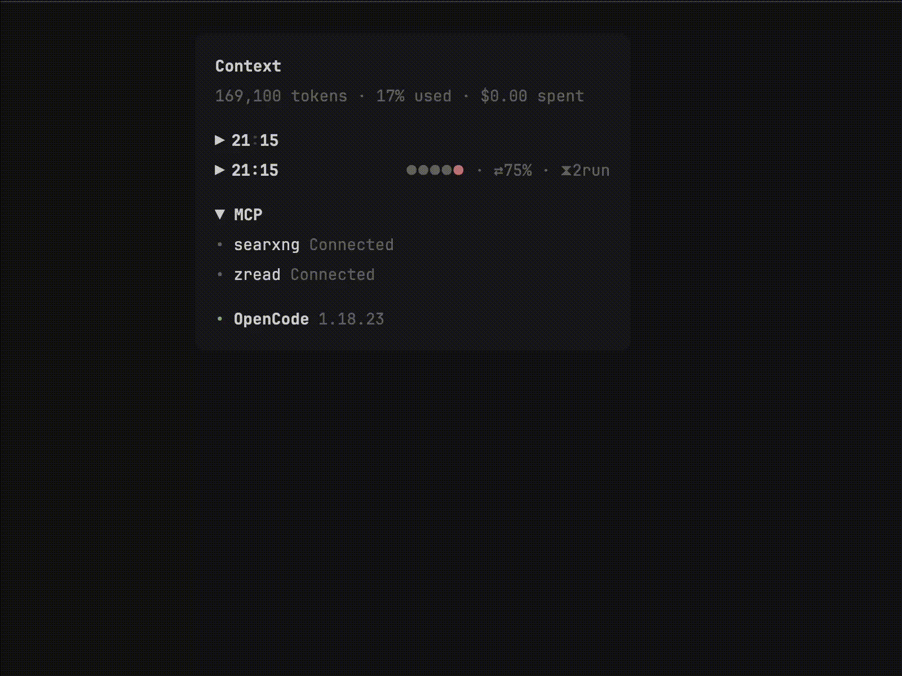

# opencode-status-bar

> OpenCode TUI 插件 — 侧边栏配额仪表盘：时间 / 电量 / 缓存命中率 / 多供应商 API 余额 / 子代理监控。

[](https://www.npmjs.com/package/opencode-status-bar)
[](https://opensource.org/licenses/MIT)

## 面板效果



```text
▼ 21:15      ▰▰▰▰▱ 81% ● · ⇄87%      ← 标题行（▼时间=折叠 · ⇄=缓存详情弹窗）
• DeepSeek                    ¥535.72   ← 货币余额（extractor 返回 text）
• 智谱          1% ▱▱▱▱▱ · 4h7m         ← 单窗：使用率 + 微条 + 重置倒计时
• 跑路哥                     $964.56
• MiniMax  19% ▰▱▱▱▱ 27% ▰▰▱▱▱ · 2h46m ← 双窗（5h/7d）单行压缩
• Kimi      6% ▰▱▱▱▱ 57% ▰▰▰▱▱ · !28m  ← ≥90% 告急行呼吸告警
◆ task   ⠋ 2 run · 1 done · 8.2k tok    ← 子代理行（有活动才显示）

折叠态：▶ 21:15 · ●●●●● · ⇄87% · ⧗2run   ← 健康星座摘要
```

- 无边框无分隔线，与 opencode 原生侧边栏（Context / MCP / LSP）排版语言一致
- 彩色即状态：**绿** <70% · **黄** ≥70% · **红** ≥90%（呼吸告警）；**accent 蓝** = 信息类（缓存/子代理）
- 充电时电量条本体低频闪烁（分档色 ↔ accent 蓝），电量分档：≥50 绿 / 20-49 黄 / <20 红
- 单行铁律：名称超 14 列自动截断；宽度不足时微条 5 格 → 3 格 → 隐藏 → 双窗丢首窗，数值永不丢失

## 使用方法

### 安装

```bash
opencode plugin add opencode-status-bar
```

或手动在 `~/.config/opencode/tui.jsonc` 中添加：

```jsonc
{
  "$schema": "https://opencode.ai/tui.json",
  "plugin": ["opencode-status-bar"]
}
```

### 更新版本（重要）

opencode 会将插件**缓存**到 `~/.cache/opencode/packages/<name>@<range>/`，之后一直使用缓存副本。`npm install -g` 更新对 TUI 插件**无效**。正确更新方式：

```bash
# 1. 删除旧缓存（移入废纸篓）
mv ~/.cache/opencode/packages/opencode-status-bar@latest ~/.Trash/

# 2. 重启 opencode —— 自动从 registry 重新拉取最新版
```

### 交互

| 操作 | 效果 |
|------|------|
| 点击 `▼ 21:15` | 折叠 / 展开面板 |
| 点击 `⇄ 87%` | 缓存详情弹窗（命中率 / token 分项 / 节省估算） |
| 点击 `◆ task` 行 | 子代理列表弹窗（状态 / token / 耗时） |
| **弹窗内点击子代理行** | **直接进入该子代理执行页面** |
| 点击余额行 | 手动刷新该行（spinner 反馈） |
| esc / 点击遮罩 | 关闭弹窗 |

## 配置方法

配置文件：`~/.config/opencode/status-bar.jsonc`（JSONC，支持 `//` 行注释）。所有配置项均有默认值，不创建该文件也可运行（只是没有余额行）。

```jsonc
{
  // ── 展示模块开关 ──
  "sections": {
    "clock": true,      // 标题行时间（冒号脉动）
    "battery": true,    // 电量微条 + 百分比
    "cache": true,      // ⇄ 缓存命中率（点击弹窗）
    "subagent": true    // ◆ 子代理监控行
  },

  // ── 动效（全部可独立关闭；intervalMs = 闪烁/脉动周期毫秒）──
  "animations": {
    "alert":    { "enabled": true,  "intervalMs": 600 },   // 告急行呼吸（≥alert 阈值）
    "charging": { "enabled": true,  "intervalMs": 1200 },  // 充电时电量条闪烁
    "clock":    { "enabled": true,  "intervalMs": 2000 },  // 时间冒号脉动
    "spinner":  { "enabled": true,  "intervalMs": 80 }     // 手动刷新 spinner
  },

  // ── 健康度分档阈值（usage ∈ 0-1）──
  "thresholds": {
    "warning": 0.7,   // ≥ 此值 → 黄色
    "alert": 0.9      // ≥ 此值 → 红色 + 呼吸
  },

  // ── 余额查询（见下文 Provider 脚本格式）──
  "balances": [ /* ... */ ]
}
```

## Provider 脚本格式

`balances[]` 每项两个字段：

| 字段 | 类型 | 说明 |
|------|------|------|
| `provider` | string | 显示名称（超 14 列自动截断） |
| `script` | string | JS 表达式，eval 后得到 `{ request, extractor }` 对象 |

### script 结构

```javascript
({
  request: {                              // HTTP 请求定义
    url: "https://api.example.com/balance",
    method: "GET",                        // 可选，默认 GET
    headers: { "Authorization": "Bearer ${MY_API_KEY}" },  // 可选
    body: "..."                           // 可选，POST 时使用
  },
  extractor: function(response) {         // response 为已解析的 JSON
    // 返回值见下文「返回值协议」
  }
})
```

- `request` 中所有字符串值支持 `${VAR_NAME}` 环境变量模板替换（变量不存在替换为空串）
- 脚本内也可直接访问 `process.env.VAR_NAME`
- 请求超时 15 秒；HTTP 非 2xx 视为失败（保留上次成功值，首次失败显示"限额满"）

### extractor 返回值协议（核心）

**① 纯字符串**（简单场景，无微条无健康度，显示为绿色）：

```javascript
extractor: function(r) {
  return "$12.34";
}
```

**② 结构化对象**（推荐，解锁微条 / 健康度 / 倒计时 / 双窗）：

| 字段 | 类型 | 必填 | 说明 |
|------|------|------|------|
| `text` | string | ✓ | 主显示文本 |
| `usage` | number | — | 0-1 使用率 → 渲染 5 格微条 + 健康度分档 |
| `resetInMs` | number | — | 距重置毫秒（查询时刻基准）→ 动态倒计时 |
| `windows` | array | — | 多窗（如 5h/7d），存在时优先于 usage |

```javascript
extractor: function(r) {
  return {
    text: "45% 2h13m",
    usage: 0.45,                // 0-1；≥thresholds.warning 黄，≥alert 红+呼吸
    resetInMs: 8_100_000
  };
}
```

**③ 双窗（windows）**——单行压缩展示，健康度取各窗最大值，倒计时显示最近重置者：

```javascript
extractor: function(r) {
  return {
    text: "19%",
    windows: [
      { usage: 0.19, resetInMs: 9_600_000 },    // 5h 窗
      { usage: 0.27, resetInMs: 432_000_000 }   // 7d 窗
    ]
  };
}
```

### 完整示例：智谱（单窗）

```jsonc
{
  "provider": "智谱",
  "script": "({ request: { url: 'https://open.bigmodel.cn/api/monitor/usage/quota/limit', method: 'GET', headers: { 'Authorization': '${ZHIPU_API_KEY}', 'Accept-Language': 'en-US,en' } }, extractor: function(r) { if (!r || !r.data || !r.data.limits) return { text: 'N/A' }; const tl = r.data.limits.find(function(l) { return l.type === 'TOKENS_LIMIT'; }); if (!tl) return { text: 'N/A' }; const usage = (tl.percentage != null ? tl.percentage : 0) / 100; return { text: Math.round(usage * 100) + '%', usage: usage, resetInMs: tl.nextResetTime != null ? tl.nextResetTime - Date.now() : undefined }; } })"
}
```

### 完整示例：DeepSeek（纯货币余额）

```jsonc
{
  "provider": "DeepSeek",
  "script": "({ request: { url: 'https://api.deepseek.com/user/balance', method: 'GET', headers: { 'Authorization': 'Bearer ${DEEPSEEK_API_KEY}' } }, extractor: function(r) { if (!r || r.is_available !== true) return { text: 'N/A' }; const i = r.balance_infos && r.balance_infos[0]; if (!i) return { text: 'N/A' }; return { text: '¥' + parseFloat(i.total_balance).toFixed(2) }; } })"
}
```

### 宽度自适应

面板宽度不足时自动降级（数值永不丢失）：

```text
全量：    19% ▰▰▱▱▱ 27% ▰▰▱▱▱ · 2h46m
微条 3 格：19% ▰▱▱ 27% ▰▱▱ · 2h46m
无微条：  19% 27% · 2h46m
双窗丢首：27% ▰▱▱▱▱ · 2h46m
极限截断：…29% · 2h46m
```

## 错误处理

| 场景 | 显示 |
|------|------|
| 配置文件不存在 / 解析失败 | 不显示余额行（debug log：`/tmp/opencode-status-bar-debug.log`） |
| 查询失败（首次，无历史值） | "限额满"，点击可重试 |
| 查询失败（有历史值） | 保留上次成功值，不闪断 |
| API 超时（15s） | 同上 |

## License

MIT
